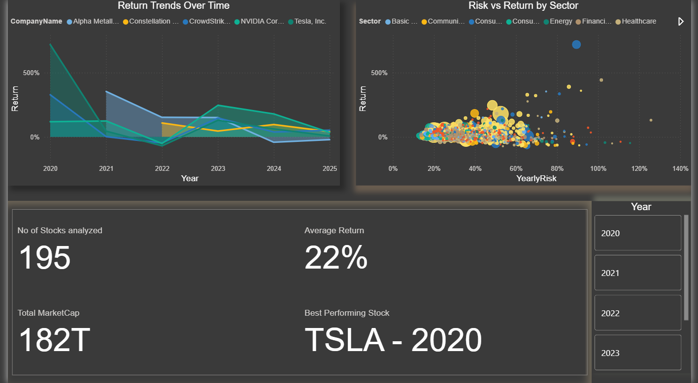
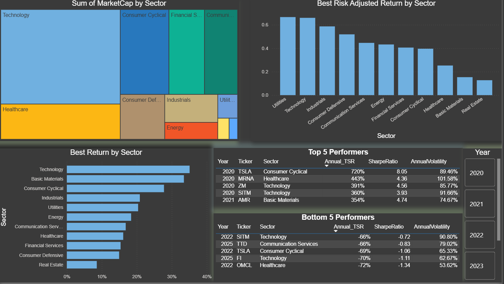
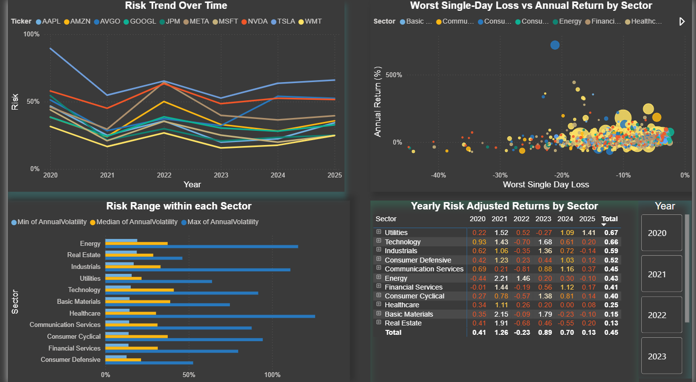
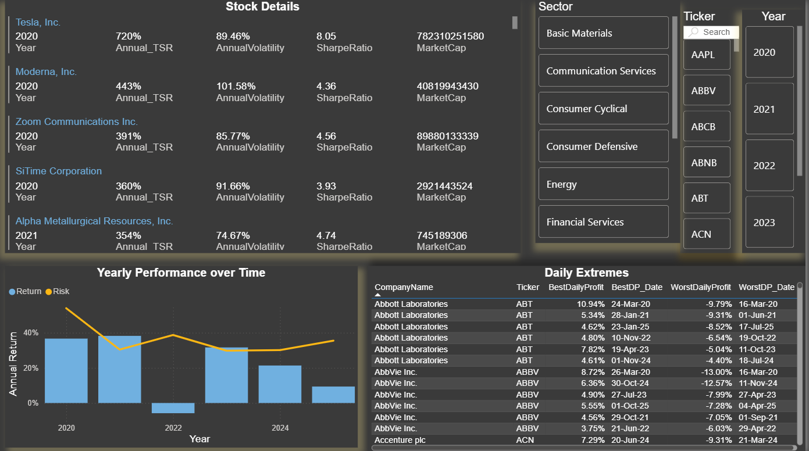

# Stock Analysis Dashboard

## Dashboard Overview

### 1. Executive Dashboard

**TSR Trends Over Time (Line Chart)** - Tracks Total Shareholder Return for top 10 stocks (by Sharpe Ratio) showing:
- Year-over-year growth consistency vs. volatility swings
- Market-wide events like the 2022 correction
- Recovery patterns and performance trajectories

**Risk vs Return by Sector(Scatter Chart)** - Scatter plot analyzing risk-return tradeoffs:
- X-axis: Volatility (risk) | Y-axis: TSR (return) | Bubble size: Market cap
- Identifies favorable sectors (high return, low risk - upper-left quadrant)
- Reveals sector clustering and company-specific risk factors
- Most companies cluster in 20-60% volatility with 0-200% TSR

**Summary Cards** - High-level portfolio statistics for quick insights

---

### 2. Sector & Industry Dashboard

**Market Cap Distribution (Treemap)** - Shows sector dominance and composition:
- Drill-down capability: Sector → Industry → Individual stocks
- Identifies diversification opportunities

**Best Risk-Adjusted Returns (Bar Chart)** - Median Sharpe Ratio by sector:
- Uses median to minimize outlier impact
- Top performers: Utilities, Technology, Industrials
- Enables sector allocation decisions

**Best Returns by Sector (Horizontal Bar)** - Average TSR ranked by sector:
- Top performers: Technology, Basic Materials, Consumer Cyclical
- Identifies growth opportunities and underperformers

**Top/Bottom Performers (Tables)** - Detailed metrics for extreme performers:
- Specific tickers, returns, volatility, and Sharpe ratios
- Enables targeted stock investigation

---

### 3. Risk Analysis Dashboard

**Volatility Trends (Line Chart)** - Annual volatility for top 10 stocks by market cap:
- Identifies consistent vs. fluctuating risk levels
- Tracks market-wide volatility events
- Assesses current risk environment

**Worst Single-Day Loss vs Annual Return (Scatter Chart)** - Downside risk assessment:
- Evaluates whether higher single-day losses correlate with better annual returns
- Reveals sector-specific risk characteristics
- Identifies outliers with strong returns despite severe drawdowns

**Volatility Range by Sector (Stacked Bar)** - Min, median, max volatility:
- Compares risk consistency across sectors
- Identifies sectors with tight clustering vs. wide spreads

**Yearly Risk-Adjusted Returns (Matrix Heatmap)** - Median Sharpe Ratio by sector/year:
- Color-coded performance tracking (2020-2025)
- Identifies persistent sector strength/weakness
- Reveals temporal patterns

---

### 4. Individual Stock Dive Dashboard

**Stock Details Table** - Comprehensive stock-level metrics:

- Company name, year, TSR, volatility, Sharpe ratio, market cap
- Sortable columns and cross-filtering
- Drill-through from sector insights

**Yearly Performance (Combo Chart)** - TSR bars with Volatility line overlay:

- Tracks how market returns correlate with risk levels over time
- Identifies years with high returns accompanied by high/low volatility
- Reveals whether strong performance came with market instability

## Glossary

**TSR (Total Shareholder Return)** - The total return of a stock, including both price appreciation and dividends, expressed as a percentage. Higher TSR indicates better overall investment performance.

**Volatility** - A measure of price fluctuation over time, typically expressed as annual standard deviation. Higher volatility = higher risk and less predictable returns.

**Sharpe Ratio** - Risk-adjusted return metric calculated as (Return - Risk-free Rate) / Volatility. Higher values indicate better returns per unit of risk taken. A Sharpe Ratio above 1.0 is generally considered good.

**Market Cap (Market Capitalization)** - Total market value of a company's outstanding shares (Stock Price × Number of Shares). Indicates company size: Large-cap (>$10B), Mid-cap ($2-10B), Small-cap (<$2B).

**Single-Day Drawdown** - The largest percentage loss experienced in a single trading day. Measures worst-case daily risk exposure.

**Median vs. Average** - Median is the middle value (less affected by extreme outliers), while average is the arithmetic mean. This dashboard uses median for risk metrics to avoid distortion from extreme values.